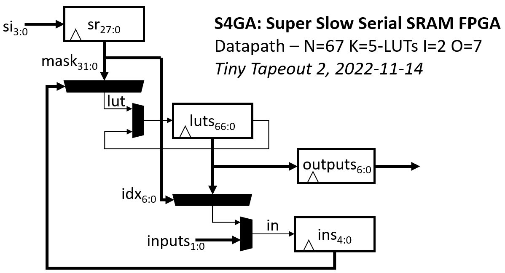

  

# tt02-s4ga

This is the TinyTapeout2 Super Slow Serial SRAM FPGA, S4GA, the best
FPGA I could implement in ~100x100um of the 130nm Skywater ASIC PDK.

This version of S4GA uses an external serial SRAM with SQI (QSPI) mode
such as the Microchip 23LC512 to continually stream in 4-bit segments
of the LUTs' config data into the device.

While the LUT configuration data is streamed in from external SRAM,
the current LUT output values are kept on-die.

As a circuit area optimization, the LUT outputs circular shift register
'luts' shifts every cycle, but LUT evaluation occurs every LL = K *
($clog2(N)+3)/4 + 2^K/4 cycles.  So within the shift register, subsequent
LUT output values are not continuous but permuted, each staggered by LL
positions, interleaved and wrapping around.

To register the last N outputs without overwriting earlier ones, this
requires GCD(N,LL)=1. Best to make N prime.

A given LUT output's index increments / wraps around to 0, each cycle.
Therefore LUT outputs' LUT input indices in the configuration bitstream
must compensate for these shenanigans.

The project is currently configured to repeatedly evaluate N=67 K=5-LUTs with LL=18 cycles.
Each LUT configuration has this format:

    // LUT config:
    struct LUT_n67_k5 { // all fields big-endian, most signif. nybble first:
        bit[8] in4;     // relative index of LUT input 4, in [0,N)
        bit[8] in3;     // relative index of LUT input 3, in [0,N)
        bit[8] in2;     // relative index of LUT input 2, in [0,N)
        bit[8] in1;     // relative index of LUT input 1, in [0,N)
        bit[8] in0;     // relative index of LUT input 0, in [0,N)
        bit[32] mask;   // 5-LUT truth table
    };

## Ripple carry LUT optimization

While evaluating each K-LUT, S4GA also evaluates the LUT's lower half-LUT
mask using the K-1 inputs in[0],...,in[K-2], into the 'Q' register.
This enables efficient ripple carry adders, using the upper half-LUT
to evaluate sum[i] and the lower half-LUT to evaluate the carry[i],
fed into the next LUT (via Q).

## Special LUT input indices: 

LUT input indices with most significant bits = 1 encode four special LUT input values.
For example with N=67, i.e. 7b indices, we have

    7'h7C   => LUT input is ith FPGA input
    7'h7D   => LUT input is Q
    7'h7E   => LUT input is constant 0
    7'h7F   => LUT input is constant 1

## I/Os

Parameter I is the number of FPGA input signals. Currently I=2.
These become the values of the first I LUTs
(i.e., the first I LUT inputs, and LUT masks, are ignored.)

Parameter O is the number of FPGA outputs. Currently O=7.
The last O LUT outputs are copied to the io_out[6:0] output register,
in each cycle in which evaluation of all of the N K-LUTs completes.
On reset, io_out[6:0] is '0.

## Pinout

All inputs are synchronous to clk.
All outputs switch on clk and switch in the same cycle.

    Pin         Signal  Description
    io_in[0]    clk     external clock
    io_in[1]    rst     +ve sync reset
    io_in[2]    si[0]   LUT configuration lsb
    io_in[3]    si[1]   LUT configuration bit
    io_in[4]    si[2]   LUT configuration bit
    io_in[5]    si[3]   LUT configuration msb
    io_in[6]    in[0]   input 0 => LUT 0
    io_in[7]    in[1]   input 1 => LUT 1
    io_out[0]   out[0]  output 0 <= LUT N-I+0
    io_out[1]   out[1]  output 1 <= LUT N-I+1
    io_out[2]   out[2]  output 2 <= LUT N-I+2
    io_out[3]   out[3]  output 3 <= LUT N-I+3
    io_out[4]   out[4]  output 4 <= LUT N-I+4
    io_out[5]   out[5]  output 5 <= LUT N-I+5
    io_out[6]   out[6]  output 6 <= LUT N-I+6
    io_out[7]   debug   debug: evaluated LUT input values, LUT output values

## Block diagram

## ASIC implementation

[Explore the GDS 3D view](https://grayresearch.github.io/tt02-s4ga).

## See also

See also my prior [Zero-to-ASIC S4GA repo](https://github.com/grayresearch/s4ga).

## TODO

1. Implement yosys + bitgen based flow Verilog => configuration bitstream

_More soon_.
